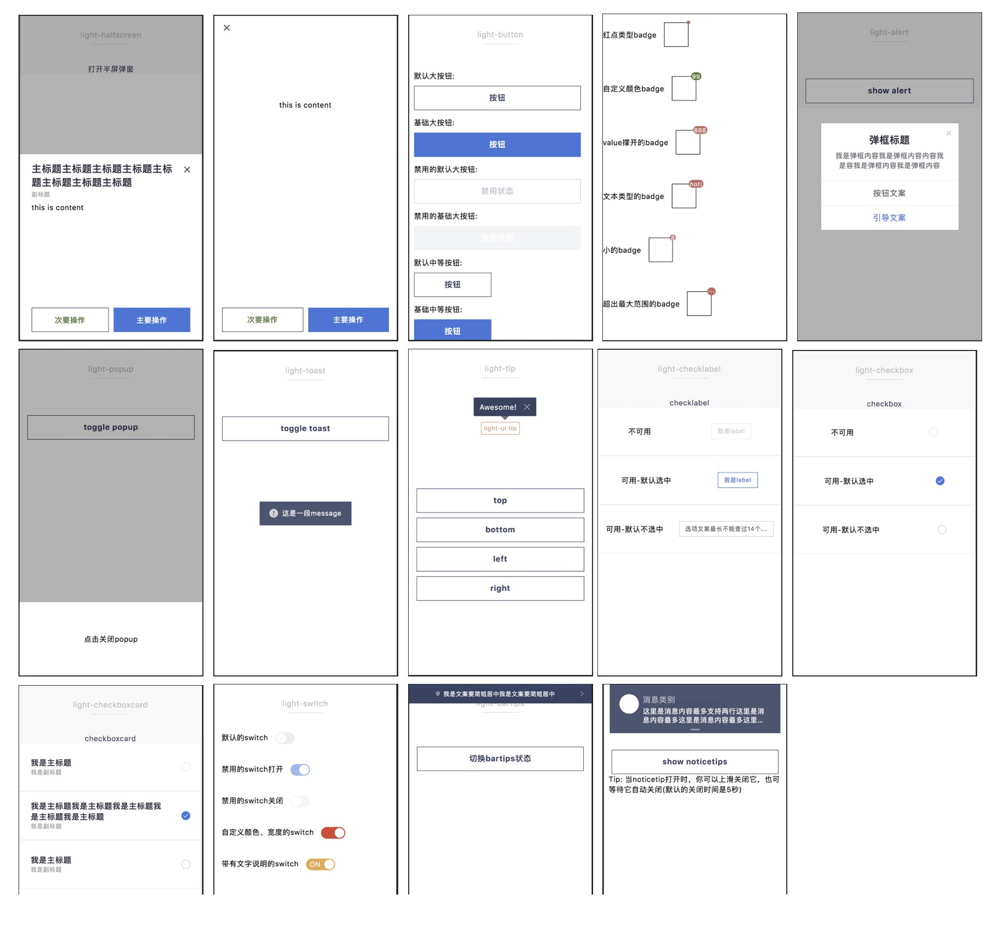

# 组件(Component)

Light-ui目标是成为一个开箱即用、多样化配置、多端高度一致的组件库。目前light-ui已提供十余个跨端组件, 可支持开发者快速完成跨端需求的开发.

| web   | weex | wx   | alipay | baidu | Qq   |
| ----- | ---- | ---- | ------ | ----- | ---- |
|  |      |      |        |       |      |

整体截图：

